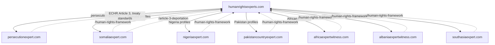
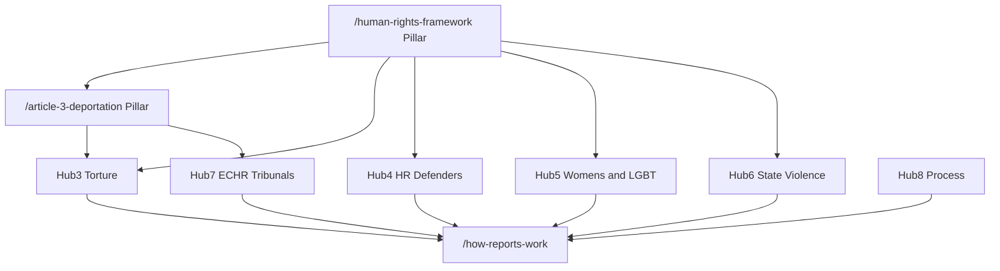
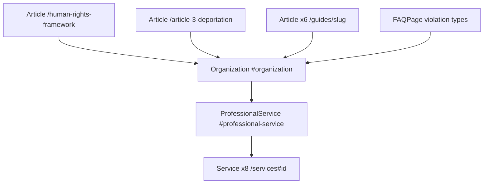

# SEO Architecture — humanrightsexperts.com

**Canonical domain:** `https://www.humanrightsexperts.com`  
**Site name:** Human Rights Experts  
**Locale:** `en_GB` (UK immigration solicitors, tribunal practitioners, Legal Aid)  
**Role:** Human rights thematic umbrella (ECHR Article 3, treaty standards, violation analysis — NOT country-specific, NOT persecution grounds)

This document is the single source of truth for keyword strategy, network positioning, content clusters, internal linking, GEO (Generative Engine Optimization), off-page SEO, schema architecture, and launch deployment for humanrightsexperts.com. All slugs and URLs align with the canonical build-spec naming convention.

**Implementation status:** This document reflects the **target** architecture (June 2026). The codebase is currently a persecution-themed scaffold pending migration. Slugs, metadata, internal linking matrix, glossary anchors, and sitemap inventory described here are the implementation targets. Run `npm run seo:generate && npm run seo:verify` after content or route changes.

**Related files:** `data/violation-types.ts`, `data/case-types.ts`, `data/guides.ts`, `data/services.ts`, `data/related-links.ts`, `lib/metadata.ts`, `lib/seo/publicUrlInventory.ts`, `scripts/generate-seo.ts`, `scripts/verify-seo.ts`

---

## 1. Keyword Strategy

### Tier 1 — Transactional

**Target pages:** homepage, services, violation types, qualifications, case types, contact.

| Keyword | Primary URL |
|---------|-------------|
| human rights expert witness UK | `/` |
| human rights expert UK | `/`, `/what-is-a-human-rights-expert-witness` |
| human rights country expert UK | `/country-experts`, `/` |
| human rights expert report asylum UK | `/services`, `/how-to-instruct` |
| Article 3 expert witness UK deportation | `/article-3-deportation`, `/case-types/article-3-deportation-removal` |
| human rights violations expert report UK | `/violation-types`, `/how-reports-work` |
| torture expert witness UK asylum | `/violation-types/torture-cruel-inhuman-treatment` |
| human rights defender expert witness UK | `/violation-types/human-rights-defenders-journalists` |
| women's human rights expert witness UK | `/violation-types/womens-human-rights-violations` |
| LGBT human rights expert witness UK | `/violation-types/lgbt-human-rights-violations` |
| Legal Aid human rights expert UK | `/how-to-instruct`, `/fees`, `/qualifications` |

### Tier 2 — Informational

**Target pages:** human rights framework pillar, Article 3 pillar, violation types, guides, glossary, how-reports-work.

| Keyword | Primary URL |
|---------|-------------|
| Article 3 ECHR deportation expert UK | `/article-3-deportation`, `/guides/article-3-deportation-guide` |
| human rights framework asylum UK | `/human-rights-framework`, `/guides/human-rights-framework-guide` |
| ICCPR expert evidence immigration tribunal | `/human-rights-framework#iccpr`, `/glossary#iccpr` |
| CAT torture expert report UK | `/violation-types/torture-cruel-inhuman-treatment`, `/guides/torture-cat-asylum-guide` |
| CEDAW women's rights expert asylum | `/violation-types/womens-human-rights-violations`, `/glossary#cedaw` |
| human rights violations severity threshold | `/human-rights-framework#violation-severity-threshold` |
| Practice Direction expert evidence 2024 | `/how-reports-work#practice-direction-2024` |
| Adam Pipe expert reports immigration 2025 | `/how-reports-work#adam-pipe-2025` |
| shrinking civic space asylum expert UK | `/violation-types/human-rights-defenders-journalists#shrinking-civic-space` |
| ECHR Article 8 expert witness UK | `/case-types/article-8-family-private-life`, `/guides/echr-immigration-tribunal-guide` |
| human rights vs persecution expert UK | `/what-is-a-human-rights-expert-witness#human-rights-vs-persecution` |

### Tier 3 — Long-tail

**Target pages:** violation types, guides, case types, pillar pages, country-experts network page.

| Keyword | Primary URL(s) |
|---------|----------------|
| Article 3 deportation risk expert report UK | `/article-3-deportation`, `/case-types/article-3-deportation-removal` |
| torture CAT asylum expert witness UK | `/violation-types/torture-cruel-inhuman-treatment`, `/guides/torture-cat-asylum-guide` |
| arbitrary detention expert report asylum | `/violation-types/arbitrary-detention-disappearance` |
| human rights defender journalist expert UK | `/violation-types/human-rights-defenders-journalists`, `/guides/human-rights-defender-asylum-guide` |
| freedom of expression asylum expert UK | `/violation-types/freedom-of-expression-assembly` |
| extrajudicial killing expert witness UK | `/violation-types/extrajudicial-killings-state-violence` |
| AAA Somalia Article 3 expert report | `/article-3-deportation#aaa-somalia` |
| DD Afghanistan return expert UK | `/article-3-deportation#dd-afghanistan` |
| Istanbul Protocol expert evidence UK | `/guides/torture-cat-asylum-guide`, `/violation-types/torture-cruel-inhuman-treatment` |
| human rights expert report Practice Direction | `/how-reports-work`, `/guides/instructing-human-rights-expert` |
| CEDAW FGM expert witness UK | `/violation-types/womens-human-rights-violations`, `/glossary#cedaw` |
| LGBT human rights criminalisation expert UK | `/violation-types/lgbt-human-rights-violations`, `/guides/echr-immigration-tribunal-guide` |

### Keyword → URL implementation reference

| Cluster | URL pattern | Meta source |
|---------|-------------|-------------|
| Brand / transactional | `/` | Page-level `createMetadata()` |
| Definition | `/what-is-a-human-rights-expert-witness` | Page-level metadata |
| HR framework pillar | `/human-rights-framework` | Page-level + section anchors |
| Article 3 pillar | `/article-3-deportation` | Page-level + section anchors |
| Violation transactional | `/violation-types/{slug}` | `data/violation-types.ts` |
| Case-type transactional | `/case-types/{slug}` | `data/case-types.ts` |
| Informational guides | `/guides/{slug}` | `data/guides.ts` |
| Process / standards | `/how-reports-work`, `/how-to-instruct` | Page-level metadata |
| Network hub | `/country-experts` | Page-level metadata |
| Services | `/services` | `data/services.ts` |

---

## 2. Unique Content Assets

1. **`/human-rights-framework` pillar** — most comprehensive human rights law guide for UK immigration solicitors (ICCPR, CAT, CEDAW, ECHR, violation severity, treaty body sources). Primary GEO citation target.

2. **`/article-3-deportation` pillar** — dedicated Article 3 ECHR deportation and removal framework (Soering, Chahal, AAA Somalia, DD Afghanistan). Unique in the network; no equivalent on country or persecution sites.

3. **`/violation-types` hub** — 8 violation category pages (thematic, not country-specific). Each targets transactional human rights violation queries.

4. **`/country-experts` network hub** — links human rights framework to country-specific expert sites and persecutionexpert.com. Sitemap priority **0.88**.

5. **Practice Direction 2024 + Adam Pipe 2025 report standards** — on `/how-reports-work` (20-page default, report structure, tribunal expectations). Supports informational and long-tail queries.

6. **Human rights vs persecution expert differentiation** — on `/what-is-a-human-rights-expert-witness` with outbound link to persecutionexpert.com. Network positioning asset; prevents keyword cannibalisation.

---

## 3. Network Positioning

humanrightsexperts.com is the **HUMAN RIGHTS thematic umbrella**. It does NOT duplicate country-specific content or Refugee Convention persecution ground analysis. Country conditions live on sibling sites; persecution methodology lives on persecutionexpert.com.



### Network sites

| Site | URL | Content role |
|------|-----|--------------|
| Human Rights Experts | [humanrightsexperts.com](https://www.humanrightsexperts.com) | Human rights violations, ECHR Article 3, treaty standards |
| Persecution Expert | [persecutionexpert.com](https://www.persecutionexpert.com) | Refugee Convention persecution grounds |
| Somalia Expert | [somaliaexpert.com](https://www.somaliaexpert.com) | Somalia country conditions |
| Nigeria Expert | [nigeriaexpert.com](https://www.nigeriaexpert.com) | Nigeria country conditions |
| Pakistan Country Expert | [pakistancountryexpert.com](https://www.pakistancountryexpert.com) | Pakistan country conditions |
| Africa Expert Witness | [africaexpertwitness.com](https://www.africaexpertwitness.com) | African country expert reports |
| Albania Expert Witness | [albaniaexpertwitness.com](https://www.albaniaexpertwitness.com) | Albania country profiles |
| South Asia Expert | [southasiaexpert.com](https://www.southasiaexpert.com) | South Asia country reports |
| South Asia Reports | [southasiareports.com](https://www.southasiareports.com) | South Asia country reports |

### Network page

**URL:** `/country-experts` (indexable, sitemap priority 0.88)

Lists all network sites with descriptive anchor text. Each card links externally with `rel="noopener noreferrer"`. Targets "human rights country expert UK" and long-tail country-report queries while keeping country content on dedicated domains.

### Cross-linking (network coordination)

- **humanrightsexperts.com links OUT** to country sites and persecutionexpert.com from `/country-experts` and contextual mentions
- **Country sites link BACK** to `/human-rights-framework` and `/article-3-deportation` where relevant (footer or profile pages)
- **persecutionexpert.com links to** humanrightsexperts.com for ECHR Article 3 and treaty standards

---

## 4. Content Clusters

Eight thematic hubs drive internal linking, anchor text, and content depth. Hubs 1 and 2 (framework and Article 3 pillars) are the master pillars connecting all violation spokes.



### Hub 1: Human Rights Framework

| Role | URL |
|------|-----|
| Pillar | `/human-rights-framework` |
| Guide | `/guides/human-rights-framework-guide` |
| Process | `/how-reports-work` |
| Glossary | `/glossary#iccpr`, `/glossary#cat-convention-against-torture`, `/glossary#cedaw`, `/glossary#udhr` |
| Spokes | All 8 `/violation-types/[slug]` pages |

**Required anchors on `/human-rights-framework`:**

| Anchor ID | Content |
|-----------|---------|
| `echr-article-3` | ECHR Article 3 prohibition |
| `iccpr` | ICCPR civil and political rights |
| `cedaw` | CEDAW women's rights standards |
| `violation-severity-threshold` | Serious violation threshold for protection |
| `human-rights-vs-persecution` | When to instruct HR vs persecution expert |

### Hub 2: Article 3 Deportation

| Role | URL |
|------|-----|
| Pillar | `/article-3-deportation` |
| Guide | `/guides/article-3-deportation-guide` |
| Case type | `/case-types/article-3-deportation-removal` |
| Case type | `/case-types/torture-survivor-claims` |
| Violation type | `/violation-types/torture-cruel-inhuman-treatment` |
| GEO anchors | `#aaa-somalia`, `#dd-afghanistan` |

### Hub 3: Torture and Ill-Treatment

| Role | URL |
|------|-----|
| Violation type | `/violation-types/torture-cruel-inhuman-treatment` |
| Guide | `/guides/torture-cat-asylum-guide` |
| Case type | `/case-types/torture-survivor-claims` |
| Glossary | `/glossary#cat-convention-against-torture`, `/glossary#istanbul-protocol` |

### Hub 4: Human Rights Defenders

| Role | URL |
|------|-----|
| Violation type | `/violation-types/human-rights-defenders-journalists` |
| Violation type | `/violation-types/freedom-of-expression-assembly` |
| Guide | `/guides/human-rights-defender-asylum-guide` |
| Case type | `/case-types/human-rights-defender-asylum` |
| GEO anchor | `/violation-types/human-rights-defenders-journalists#shrinking-civic-space` |

### Hub 5: Women's and LGBT Human Rights

| Role | URL |
|------|-----|
| Violation type | `/violation-types/womens-human-rights-violations` |
| Violation type | `/violation-types/lgbt-human-rights-violations` |
| Case type | `/case-types/medical-human-rights-claims` |
| Glossary | `/glossary#cedaw` |

### Hub 6: State Violence and Detention

| Role | URL |
|------|-----|
| Violation type | `/violation-types/extrajudicial-killings-state-violence` |
| Violation type | `/violation-types/arbitrary-detention-disappearance` |
| Case type | `/case-types/ftt-human-rights-appeal` |

### Hub 7: ECHR in Tribunals

| Role | URL |
|------|-----|
| Guide | `/guides/echr-immigration-tribunal-guide` |
| Case type | `/case-types/article-8-family-private-life` |
| Case type | `/case-types/upper-tribunal-human-rights` |
| Pillar | `/article-3-deportation` |

### Hub 8: Process and Standards

| Role | URL |
|------|-----|
| Report standards | `/how-reports-work` |
| Instruction | `/how-to-instruct` |
| Guide | `/guides/instructing-human-rights-expert` |
| Qualifications | `/qualifications` |
| FAQ | `/faq` |

### Violation type minimum links matrix

| Violation slug | Framework anchor | Guide | Case type |
|----------------|------------------|-------|-----------|
| `torture-cruel-inhuman-treatment` | `#echr-article-3` | `torture-cat-asylum-guide` | `torture-survivor-claims` |
| `arbitrary-detention-disappearance` | `#iccpr` | `human-rights-framework-guide` | `ftt-human-rights-appeal` |
| `freedom-of-expression-assembly` | `#iccpr` | `human-rights-defender-asylum-guide` | `human-rights-defender-asylum` |
| `freedom-of-religion-belief` | `#iccpr` | `human-rights-framework-guide` | `fresh-human-rights-claims` |
| `womens-human-rights-violations` | `#cedaw` | `human-rights-framework-guide` | `medical-human-rights-claims` |
| `lgbt-human-rights-violations` | `#iccpr` | `echr-immigration-tribunal-guide` | `article-8-family-private-life` |
| `human-rights-defenders-journalists` | `#shrinking-civic-space` | `human-rights-defender-asylum-guide` | `human-rights-defender-asylum` |
| `extrajudicial-killings-state-violence` | `#iccpr` | `human-rights-framework-guide` | `ftt-human-rights-appeal` |

---

## 5. GEO Optimization Targets

Content structured for AI citation and featured snippets: definition-first, tables, numbered steps, citeable legal standards.

| # | GEO target | URL | Required extractable artifact |
|---|------------|-----|------------------------------|
| 1 | Human rights instruments table | `/human-rights-framework` | ECHR, ICCPR, CAT, CEDAW, ICERD, UDHR table with expert role column |
| 2 | Article 3 framework table | `/article-3-deportation` | Soering/Chahal/AAA/DD comparison table with 2025–2026 updates |
| 3 | Violation severity threshold | `/human-rights-framework#violation-severity-threshold` | Definition + numbered criteria for serious violation |
| 4 | Human rights vs persecution expert comparison | `/what-is-a-human-rights-expert-witness#human-rights-vs-persecution` | Side-by-side table (scope, sources, when to instruct) |
| 5 | Practice Direction 2024 report limits | `/how-reports-work#practice-direction-2024` | 20-page default, permission process, PD 9.2/9.3 |
| 6 | Expert report 7-point structure | `/how-reports-work` | Numbered list (qualifications, sources, standards, conditions, severity, return risk, statement of truth) |
| 7 | CAT torture definition | `/violation-types/torture-cruel-inhuman-treatment` | CAT Article 1 definition block + Article 3 distinction |
| 8 | Shrinking civic space 2025–2026 | `/violation-types/human-rights-defenders-journalists#shrinking-civic-space` | Citeable summary + UN Special Rapporteur references |

### GEO content rules

- Lead with a direct answer paragraph (40 to 60 words) before depth.
- Tables use `<table>` with `<caption>` and header row for accessibility and parsing.
- Include source citations (OSCOLA-style) where legal standards or treaty body positions are cited.
- Avoid gating key factual content behind accordions only.

### Human rights instruments table (GEO #1), required rows

| Instrument | Relevance to UK Proceedings | Expert Role |
|------------|----------------------------|-------------|
| ECHR Article 3 | Prohibition of torture, inhuman or degrading treatment | Assess return risk severity |
| ICCPR | Civil and political rights standards | Benchmark state conduct |
| CAT | Torture definition and state obligations | Torture risk analysis |
| CEDAW | Women's rights and discrimination | Gender-based violation analysis |
| ICERD | Racial discrimination | Ethnic targeting analysis |
| UDHR | Foundational rights reference | Contextual framework |

### Expert report 7-point structure (GEO #6), required elements

1. Expert qualifications and methodology
2. Sources (treaty body reports, OHCHR, NGO reports, CPINs, field research)
3. Applicable human rights standards
4. Country conditions relevant to the specific profile
5. Violation severity analysis
6. Return risk opinion (Article 3 where applicable)
7. Statement of truth and declaration of independence

---

## 6. Internal Linking Rules

### Rule A: Every `/violation-types/[slug]` must link to:

- `/human-rights-framework` (relevant section anchor from matrix above)
- `/how-reports-work`
- `/country-experts`
- At least 1 `/guides/[slug]` page
- At least 1 `/case-types/[slug]` page
- `/how-to-instruct`
- `/contact`

### Rule B: Both pillar pages must link to:

- All 8 `/violation-types/[slug]` pages
- All 6 `/guides/[slug]` pages
- `/how-reports-work`
- `/country-experts`
- `/how-to-instruct`
- `/contact`

### Rule C: `/country-experts` must link to:

- All network sites (external, `rel="noopener noreferrer"`)
- `/human-rights-framework`
- `/article-3-deportation`
- Top 4 violation types: torture, HR defenders, women's rights, LGBT rights
- `/how-to-instruct`

### Rule D: Homepage must link to:

- `/human-rights-framework`
- `/article-3-deportation`
- Top 4 violation types (torture, HR defenders, women's rights, LGBT rights)
- `/how-reports-work`
- `/country-experts`
- `/how-to-instruct`
- `/contact`

### Rule E: Glossary terms must link to:

- Most relevant `/violation-types/[slug]`
- Most relevant `/guides/[slug]`
- `/human-rights-framework` where applicable

**Enforcement:** populate `relatedLinks` in `data/related-links.ts` from [Appendix D](#appendix-d-related-links-matrix). Use descriptive anchor text (e.g. "Article 3 ECHR deportation framework" not "click here").

**Cross-linking priority:** human-rights-framework pillar → violation type → how-reports-work → country-experts → contact.

---

## 7. Off-Page SEO Targets

### Directories (listing submissions)

| Directory | URL | Target page to link |
|-----------|-----|---------------------|
| Electronic Immigration Network (EIN) | [ein.org.uk/experts](https://ein.org.uk/experts) | `/`, `/violation-types/*` — list as **Human Rights Expert** under "expert reports" category |
| ILPA membership directory | ILPA member directory | `/qualifications`, `/how-reports-work` |
| Free Movement | [freemovement.org.uk](https://freemovement.org.uk) | `/human-rights-framework`, `/guides/*` |
| UNHCR UK | Outreach target | `/human-rights-framework` |
| Refugee Action | Outreach target | `/violation-types/womens-human-rights-violations` |
| Garden Court Chambers | Linking partner — complementary practice | `/how-reports-work`, `/article-3-deportation` |
| LinkedIn | [HumanRightsExpertsUK](https://www.linkedin.com/company/HumanRightsExpertsUK) | `sameAs` in Organization schema |

**Submission tracking template:**

| Directory | Owner | Submitted | Live URL | Referral sessions/mo |
|-----------|-------|-----------|----------|----------------------|
| EIN | | | | |
| ILPA | | | | |
| Free Movement | | | | |
| UNHCR UK | | | | |
| Refugee Action | | | | |
| Garden Court Chambers | | | | |
| LinkedIn | | | | |

### Publications (citations / guest content)

| Publication | Focus |
|-------------|-------|
| Free Movement | freemovement.org.uk: Article 3, human rights appeals, expert evidence |
| ILPA | Immigration practitioners, tribunal practice, expert evidence |
| Legal Action Group (LAG) | Legal aid, tribunal practice |
| UK Human Rights Blog | ECHR, treaty standards, deportation risk |

### Digital PR angles

1. **Human Rights Law in UK Asylum Proceedings: What Solicitors Need from a Human Rights Expert** (supports `/human-rights-framework` and GEO #1)
2. **Article 3 ECHR Deportation: The Real Risk Test Explained for Expert Reports** (Hub 2, GEO #2)
3. **Human Rights Expert vs Persecution Expert: When to Instruct Which** (GEO #4, network positioning)
4. **Practice Direction 2024: What the 20-Page Report Limit Means for Human Rights Experts** (`/how-reports-work`, GEO #5 and #6)
5. **Shrinking Civic Space 2025–2026: Expert Evidence for HR Defender Asylum Claims** (Hub 4, GEO #8)
6. **AAA (Somalia) and DD (Afghanistan): Article 3 Return Risk in 2026** (`/article-3-deportation`)

---

## 8. Deployment Checklist

| Task | Implementation | Status |
|------|----------------|--------|
| Vercel or Netlify deployment | Connect repo; production branch deploy | Pending (manual) |
| DNS: `humanrightsexperts.com` → www | Registrar CNAME + `middleware.ts` apex 301 | Pending (manual) |
| `NEXT_PUBLIC_SITE_URL` / `SITE_URL` | `https://www.humanrightsexperts.com` in `lib/constants.ts` | Pending |
| Contact form → Formspree | `/contact` → `/thank-you` | Target |
| `GOOGLE_SITE_VERIFICATION` | `metadata.verification.google` in `app/layout.tsx` | Pending (env var) |
| `BING_SITE_VERIFICATION` | `metadata.other` in layout | Pending (env var) |
| `NEXT_PUBLIC_GA_MEASUREMENT_ID` | Analytics component (consent-gated) | Pending (env var) |
| `html lang="en-GB"` | Root layout `<html lang="en-GB">` | Target |
| `hreflang` | `en-GB`, `en-US`, `x-default` in `alternates.languages` | Target |
| `npm run seo:generate` before deploy | Writes `public/sitemap.xml` and `public/robots.txt` | Target |
| `npm run seo:verify` passes | Sitemap matches `publicUrlInventory` | Target |
| Submit sitemap | GSC + Bing Webmaster: `/sitemap.xml` | Pending (post-deploy) |
| Google Search Console | Domain property for humanrightsexperts.com | Pending (post-deploy) |
| LinkedIn company page | `HumanRightsExpertsUK` → `sameAs` in Organization schema | Pending |
| EIN directory submission | ein.org.uk/experts — "expert reports" category | Manual post-launch |
| Cross-link from persecutionexpert.com | Link to `/human-rights-framework`, `/article-3-deportation` | Manual post-launch |
| Cross-link from country sites | Link back to `/human-rights-framework` | Manual post-launch |

**Canonical and robots:**

- All pages: canonical via `createMetadata()` in `lib/metadata.ts`
- Staging/preview: `noindex: true` on non-production hosts
- Production: `app/robots.ts` allow `/`, point to sitemap
- Exclude from sitemap: `/contact`, `/thank-you`, `/privacy`, `/terms`, `/cookie-policy`

**Target middleware pattern:**

```ts
const PRIMARY_HOST = "www.humanrightsexperts.com";
const PRIMARY_ORIGIN = "https://www.humanrightsexperts.com";
const REDIRECT_HOSTS = new Set([
  "humanrightsexperts.com",
]);
```

**Environment variables:**

| Variable | Purpose |
|----------|---------|
| `NEXT_PUBLIC_SITE_URL` | Canonical site URL |
| `NEXT_PUBLIC_FORMSPREE_FORM_ID` | Contact form submission |
| `GOOGLE_SITE_VERIFICATION` | Search Console verification |
| `BING_SITE_VERIFICATION` | Bing Webmaster verification |
| `NEXT_PUBLIC_GA_MEASUREMENT_ID` | Google Analytics 4 |
| `NEXT_PUBLIC_GTM_ID` | Google Tag Manager (optional) |
| `NEXT_PUBLIC_LINKEDIN_PARTNER_ID` | LinkedIn Insight Tag (optional) |

---

## 9. Sitemap Priorities

| Route | Priority |
|-------|----------|
| `/` | 1.0 |
| `/human-rights-framework` | 0.95 |
| `/article-3-deportation` | 0.95 |
| `/how-reports-work` | 0.93 |
| `/violation-types` | 0.93 |
| `/violation-types/[slug]` | 0.92 |
| `/case-types` | 0.90 |
| `/case-types/[slug]` | 0.88 |
| `/services` | 0.90 |
| `/country-experts` | 0.88 |
| `/qualifications` | 0.88 |
| `/how-to-instruct` | 0.88 |
| `/fees` | 0.87 |
| `/guides` | 0.87 |
| `/guides/[slug]` | 0.82 |
| `/faq` | 0.87 |
| `/glossary` | 0.75 |
| `/privacy`, `/terms` | 0.3 (noindex) |
| `/thank-you` | excluded from sitemap |

**Canonical source:** `lib/seo/publicUrlInventory.ts` — update `APP_STATIC_PATHS` and dynamic slug entries to match this table after migration.

**Priority boost for highest-volume violation types:**

- `/violation-types/torture-cruel-inhuman-treatment`: top transactional spoke (Hub 3)
- `/violation-types/human-rights-defenders-journalists`: second priority (Hub 4, shrinking civic space GEO)

---

## 10. Keyword → URL Implementation Reference

| Cluster | URL pattern | Meta source |
|---------|-------------|-------------|
| Brand / transactional | `/` | Page-level `createMetadata()` |
| Definition | `/what-is-a-human-rights-expert-witness` | Page-level metadata |
| HR framework pillar | `/human-rights-framework` | Page-level + section anchors |
| Article 3 pillar | `/article-3-deportation` | Page-level + section anchors |
| Violation transactional | `/violation-types/{slug}` | `data/violation-types.ts` |
| Case-type transactional | `/case-types/{slug}` | `data/case-types.ts` |
| Informational guides | `/guides/{slug}` | `data/guides.ts` |
| Process / standards | `/how-reports-work`, `/how-to-instruct` | Page-level metadata |
| Network hub | `/country-experts` | Page-level metadata |
| Services | `/services` | `data/services.ts` |

---

## 11. Schema Architecture

### Root entity

```json
{
  "@type": "Organization",
  "@id": "https://www.humanrightsexperts.com/#organization",
  "name": "Human Rights Experts",
  "url": "https://www.humanrightsexperts.com",
  "sameAs": ["https://www.linkedin.com/company/HumanRightsExpertsUK"]
}
```

### Schema graph overview



### Schema by route type

| Route | Schema types |
|-------|--------------|
| `/` | Organization, ProfessionalService, WebSite |
| `/human-rights-framework` | Organization, Article, BreadcrumbList |
| `/article-3-deportation` | Organization, Article, BreadcrumbList |
| `/violation-types/[slug]` | Organization, BreadcrumbList, FAQPage (if faqs) |
| `/guides/[slug]` | Organization, Article, BreadcrumbList |
| `/case-types/[slug]` | Organization, BreadcrumbList, FAQPage (if faqs) |
| `/how-reports-work` | Organization, Article, BreadcrumbList, FAQPage |
| `/what-is-a-human-rights-expert-witness` | Organization, Article, BreadcrumbList, FAQPage |
| `/country-experts` | Organization, BreadcrumbList |
| `/glossary` | Organization, BreadcrumbList, FAQPage |

**Helpers:** `lib/schema.ts`, `components/seo/PageJsonLd.tsx`, `components/ui/JsonLd.tsx`

---

## 12. Technical SEO

### Metadata

`createMetadata()` in `lib/metadata.ts` sets title, description, canonical URL, Open Graph (`locale: "en_GB"`), Twitter card, and robots directives. Non-production hosts receive `noindex`.

### hreflang

Root layout `alternates.languages`:

```ts
alternates: {
  languages: {
    "en-GB": SITE_URL,
    "en-US": SITE_URL,
    "x-default": SITE_URL,
  },
},
```

### Sitemap and robots generation

- `buildPublicUrlInventory()` in `lib/seo/publicUrlInventory.ts` merges static `APP_STATIC_PATHS` plus dynamic slugs from `data/violation-types.ts`, `data/case-types.ts`, `data/guides.ts`, `data/services.ts`
- `scripts/generate-seo.ts` writes `public/sitemap.xml` and `public/robots.txt`
- `npm run seo:generate` regenerates both (also runs in `prebuild`)
- `npm run seo:verify` fails if sitemap drifts from inventory or internal link rules fail
- Canonical host: `https://www.humanrightsexperts.com`
- `robots.txt`: Allow `/`; Disallow `/api/`, `/.netlify/`; Sitemap line with canonical host

### Non-indexable paths

`NON_INDEXABLE_PATHS` in `lib/seo/publicUrlInventory.ts`:

- `/contact` — excluded from sitemap, noindex
- `/thank-you` — excluded from sitemap, noindex, nofollow
- `/privacy` — noindex, follow
- `/terms` — noindex, follow
- `/cookie-policy` — noindex, follow

---

## Appendix A: Full URL Inventory (~45 routes)

### Static and hub pages (16 indexable)

| URL | Sitemap priority |
|-----|------------------|
| `/` | 1.0 |
| `/human-rights-framework` | 0.95 |
| `/article-3-deportation` | 0.95 |
| `/how-reports-work` | 0.93 |
| `/violation-types` | 0.93 |
| `/case-types` | 0.90 |
| `/services` | 0.90 |
| `/what-is-a-human-rights-expert-witness` | 0.90 |
| `/country-experts` | 0.88 |
| `/qualifications` | 0.88 |
| `/how-to-instruct` | 0.88 |
| `/fees` | 0.87 |
| `/guides` | 0.87 |
| `/faq` | 0.87 |
| `/experts` | 0.80 |
| `/glossary` | 0.75 |

### Dynamic pages (30)

| Pattern | Count | Sitemap priority |
|---------|-------|------------------|
| `/violation-types/{slug}` | 8 | 0.92 |
| `/case-types/{slug}` | 8 | 0.88 |
| `/guides/{slug}` | 6 | 0.82 |
| `/services/{id}` | 8 | 0.90 |

### Legal / utility (noindex or excluded)

| URL | Robots |
|-----|--------|
| `/contact` | Excluded from sitemap |
| `/privacy` | noindex, follow |
| `/terms` | noindex, follow |
| `/cookie-policy` | noindex, follow |
| `/thank-you` | noindex, nofollow |

**Total indexable URLs:** ~45 (excluding `/contact`, `/thank-you`, `/privacy`, `/terms`, `/cookie-policy`).

---

## Appendix B: Canonical Slug Lists

### Violation type slugs (8)

`torture-cruel-inhuman-treatment`, `arbitrary-detention-disappearance`, `freedom-of-expression-assembly`, `freedom-of-religion-belief`, `womens-human-rights-violations`, `lgbt-human-rights-violations`, `human-rights-defenders-journalists`, `extrajudicial-killings-state-violence`

### Guide slugs (6)

`article-3-deportation-guide`, `human-rights-framework-guide`, `torture-cat-asylum-guide`, `human-rights-defender-asylum-guide`, `echr-immigration-tribunal-guide`, `instructing-human-rights-expert`

### Case type slugs (8)

`ftt-human-rights-appeal`, `upper-tribunal-human-rights`, `article-3-deportation-removal`, `article-8-family-private-life`, `fresh-human-rights-claims`, `human-rights-defender-asylum`, `torture-survivor-claims`, `medical-human-rights-claims`

---

## Appendix C: Required Glossary Anchor IDs

| Term | Anchor ID |
|------|-----------|
| Article 3 ECHR | `article-3-echr` |
| Article 8 ECHR | `article-8-echr` |
| Anxious Scrutiny | `anxious-scrutiny` |
| CAT (Convention Against Torture) | `cat-convention-against-torture` |
| CEDAW | `cedaw` |
| Chahal v UK [1996] | `chahal-v-uk-1996` |
| ECHR | `echr` |
| Extrajudicial Killing | `extrajudicial-killing` |
| Freedom of Expression (ICCPR Art 19) | `freedom-of-expression` |
| Human Rights Act 1998 | `human-rights-act-1998` |
| Human Rights Defender | `human-rights-defender` |
| ICCPR | `iccpr` |
| ICERD | `icerd` |
| Ikarian Reefer | `ikarian-reefer` |
| Inhuman or Degrading Treatment | `inhuman-or-degrading-treatment` |
| Istanbul Protocol | `istanbul-protocol` |
| Non-Refoulement | `non-refoulement` |
| OHCHR | `ohchr` |
| Practice Direction (Expert Evidence) | `practice-direction-expert-evidence` |
| Real Risk | `real-risk` |
| Shrinking Civic Space | `shrinking-civic-space` |
| Soering v UK [1989] | `soering-v-uk-1989` |
| Special Rapporteur | `special-rapporteur` |
| Torture (CAT definition) | `torture-cat-definition` |
| Treaty Body | `treaty-body` |
| UDHR | `udhr` |
| Universal Periodic Review (UPR) | `universal-periodic-review` |
| Yogyakarta Principles | `yogyakarta-principles` |
| Adam Pipe Guide (October 2025) | `adam-pipe-guide-october-2025` |

**SEO-critical anchor mappings:**

| Shorthand | Canonical anchor |
|-----------|------------------|
| Article 3 | `/article-3-deportation` or `#article-3-echr` |
| CAT | `#cat-convention-against-torture` |
| CEDAW | `#cedaw` |
| ICCPR | `#iccpr` |
| Shrinking civic space | `#shrinking-civic-space` |

---

## Appendix D: Related Links Matrix

Minimum internal links enforced via `data/related-links.ts` and verified by `npm run seo:verify`.

### Per violation type (`relatedLinks` minimum)

| Violation slug | Required internal paths |
|----------------|------------------------|
| `torture-cruel-inhuman-treatment` | `/human-rights-framework#echr-article-3`, `/how-reports-work`, `/country-experts`, `/guides/torture-cat-asylum-guide`, `/case-types/torture-survivor-claims`, `/how-to-instruct`, `/contact` |
| `arbitrary-detention-disappearance` | `/human-rights-framework#iccpr`, `/how-reports-work`, `/country-experts`, `/guides/human-rights-framework-guide`, `/case-types/ftt-human-rights-appeal`, `/how-to-instruct`, `/contact` |
| `freedom-of-expression-assembly` | `/human-rights-framework#iccpr`, `/how-reports-work`, `/country-experts`, `/guides/human-rights-defender-asylum-guide`, `/case-types/human-rights-defender-asylum`, `/how-to-instruct`, `/contact` |
| `freedom-of-religion-belief` | `/human-rights-framework#iccpr`, `/how-reports-work`, `/country-experts`, `/guides/human-rights-framework-guide`, `/case-types/fresh-human-rights-claims`, `/how-to-instruct`, `/contact` |
| `womens-human-rights-violations` | `/human-rights-framework#cedaw`, `/how-reports-work`, `/country-experts`, `/guides/human-rights-framework-guide`, `/case-types/medical-human-rights-claims`, `/how-to-instruct`, `/contact` |
| `lgbt-human-rights-violations` | `/human-rights-framework#iccpr`, `/how-reports-work`, `/country-experts`, `/guides/echr-immigration-tribunal-guide`, `/case-types/article-8-family-private-life`, `/how-to-instruct`, `/contact` |
| `human-rights-defenders-journalists` | `/human-rights-framework#shrinking-civic-space`, `/how-reports-work`, `/country-experts`, `/guides/human-rights-defender-asylum-guide`, `/case-types/human-rights-defender-asylum`, `/how-to-instruct`, `/contact` |
| `extrajudicial-killings-state-violence` | `/human-rights-framework#iccpr`, `/how-reports-work`, `/country-experts`, `/guides/human-rights-framework-guide`, `/case-types/ftt-human-rights-appeal`, `/how-to-instruct`, `/contact` |

### Pillar pages (`relatedLinks` minimum)

Both `/human-rights-framework` and `/article-3-deportation` must include links to all 8 violation types, all 6 guides, `/how-reports-work`, `/country-experts`, `/how-to-instruct`, `/contact`.

### Homepage (`relatedLinks` minimum)

`/`, `/article-3-deportation`, `/violation-types/torture-cruel-inhuman-treatment`, `/violation-types/human-rights-defenders-journalists`, `/violation-types/womens-human-rights-violations`, `/violation-types/lgbt-human-rights-violations`, `/how-reports-work`, `/country-experts`, `/how-to-instruct`, `/contact`

---

## Appendix E: Network Outbound Link Matrix

Minimum external links from `/country-experts` and footer network block.

| Network site | External URL | Anchor text (examples) |
|--------------|--------------|------------------------|
| Persecution Expert | `https://www.persecutionexpert.com` | Refugee Convention persecution expert UK |
| Somalia Expert | `https://www.somaliaexpert.com` | Somalia expert witness UK |
| Nigeria Expert | `https://www.nigeriaexpert.com` | Nigeria expert reports UK |
| Pakistan Country Expert | `https://www.pakistancountryexpert.com` | Pakistan country expert reports |
| Africa Expert Witness | `https://www.africaexpertwitness.com` | Africa expert witness reports |
| Albania Expert Witness | `https://www.albaniaexpertwitness.com` | Albania expert witness reports |
| South Asia Expert | `https://www.southasiaexpert.com` | South Asia expert witness UK |
| South Asia Reports | `https://www.southasiareports.com` | South Asia country expert reports |

**Reciprocal link targets on sibling sites** (coordination):

| Sibling site | Link back to humanrightsexperts.com |
|--------------|-------------------------------------|
| persecutionexpert.com | `/human-rights-framework`, `/article-3-deportation` |
| somaliaexpert.com | `/human-rights-framework`, `/article-3-deportation` |
| nigeriaexpert.com | `/human-rights-framework` |
| pakistancountryexpert.com | `/human-rights-framework` |
| africaexpertwitness.com | `/human-rights-framework`, `/article-3-deportation` |
| albaniaexpertwitness.com | `/human-rights-framework` |
| southasiaexpert.com | `/human-rights-framework` |

---

## Appendix F: Slug Redirects (Migration)

301 redirects in `lib/seo/slug-redirects.ts` during persecution-scaffold migration:

| Legacy path | Canonical path |
|-------------|----------------|
| `/persecution-grounds` | `/human-rights-framework` |
| `/persecution-types` | `/violation-types` |
| `/persecution-types/{slug}` | `/violation-types/{mapped-slug}` |
| `/what-is-a-persecution-expert` | `/what-is-a-human-rights-expert-witness` |
| `/what-is-a-persecution-expert-witness` | `/what-is-a-human-rights-expert-witness` |

---

## Appendix G: Implementation Status Matrix

| Asset | Data file | Route | Metadata | Schema | Internal links |
|-------|-----------|-------|----------|--------|----------------|
| Homepage | Target | Pending | Pending | Organization, ProfessionalService | Rule D |
| `/human-rights-framework` | Target | Pending | Pending | Article, BreadcrumbList | Rule B |
| `/article-3-deportation` | Target | Pending | Pending | Article, BreadcrumbList | Rule B |
| Violation types ×8 | `data/violation-types.ts` | Pending | Pending | BreadcrumbList, FAQPage | Rule A |
| Guides ×6 | `data/guides.ts` | Pending | Pending | Article, BreadcrumbList | Rule B |
| Case types ×8 | `data/case-types.ts` | Pending | Pending | BreadcrumbList, FAQPage | Rule A |
| `/how-reports-work` | Target | Pending | Pending | Article, FAQPage | GEO #5, #6 |
| `/country-experts` | `data/network-sites.ts` | Pending | Pending | BreadcrumbList | Rule C, Appendix E |
| `/glossary` | `data/glossary.ts` | Pending | Pending | FAQPage | Rule E, Appendix C |
| Sitemap / robots | `lib/seo/publicUrlInventory.ts` | Pending | — | — | `seo:verify` |
| Related links | `data/related-links.ts` | Pending | — | — | Appendix D |

### Code migration checklist (post-doc)

1. Rebrand `lib/constants.ts` → `SITE_URL`, `SITE_NAME`, `SITE_EMAIL`, `LINKEDIN_URL` for humanrightsexperts.com
2. Rename `data/persecution-types.ts` → `data/violation-types.ts` with human rights content
3. Add routes: `/human-rights-framework`, `/article-3-deportation`, `/violation-types/*`
4. Create `data/related-links.ts` per Appendix D
5. Update `lib/seo/publicUrlInventory.ts` static paths and slug imports
6. Update `data/network-sites.ts` with full network (9 sites)
7. Run `npm run seo:generate && npm run seo:verify`

### Related files

`lib/metadata.ts`, `lib/schema.ts`, `lib/constants.ts`, `middleware.ts`, `data/violation-types.ts`, `data/case-types.ts`, `data/guides.ts`, `data/glossary.ts`, `data/related-links.ts`, `data/services.ts`, `data/network-sites.ts`, `lib/seo/slug-redirects.ts`, `lib/seo/publicUrlInventory.ts`, `scripts/generate-seo.ts`, `scripts/verify-seo.ts`

### Document history

| Version | Date | Notes |
|---------|------|-------|
| 1.0 | 2026-06-15 | Initial SEO architecture for humanrightsexperts.com (human rights thematic umbrella) |
